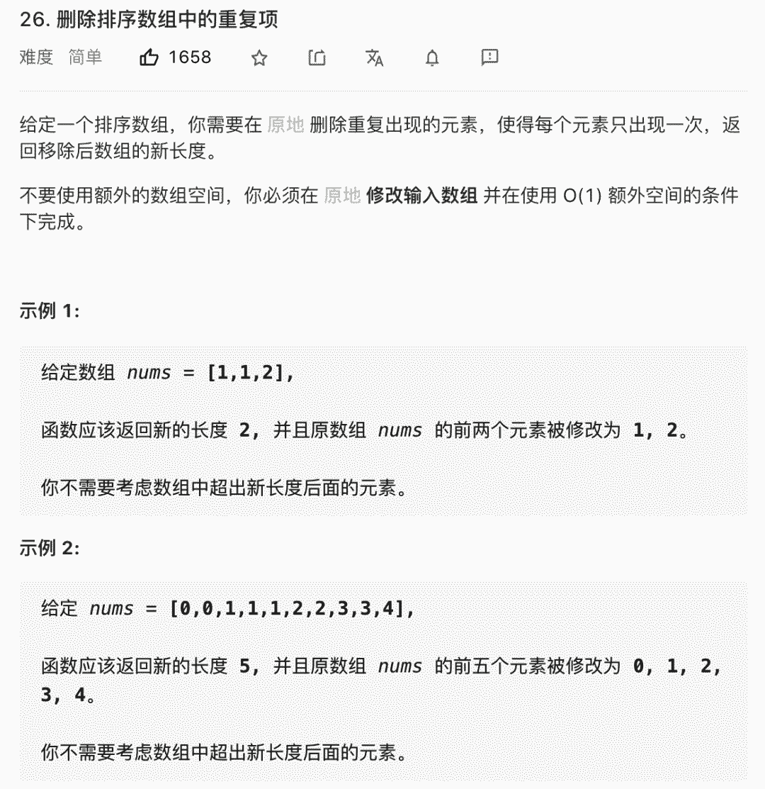
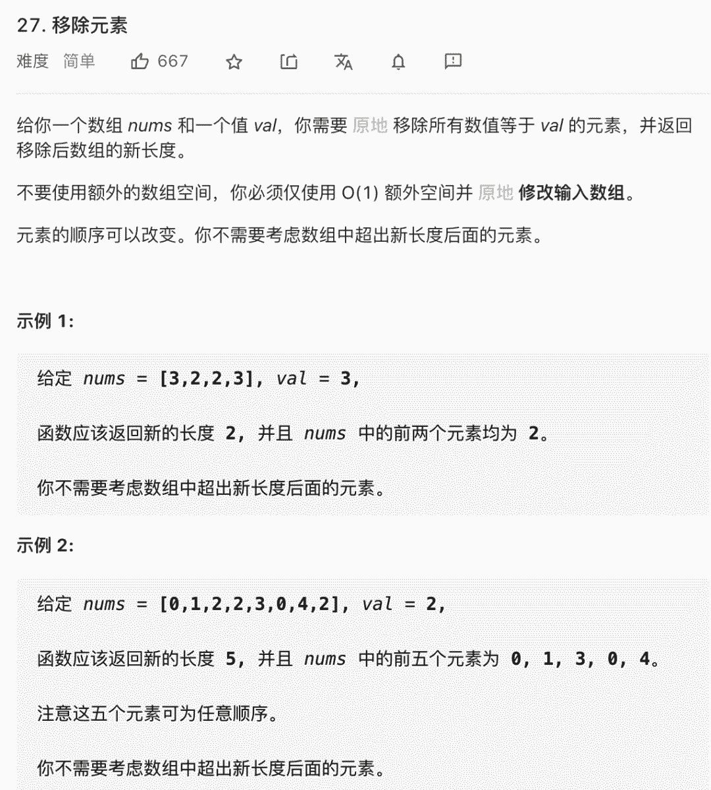

## 双指针技巧秒杀四道数组/链表题目

## 本文转载自微信公众号labuladong，《[双指针技巧秒杀四道数组/链表题目](https://mp.weixin.qq.com/s/55UPwGL0-Vgdh8wUEPXpMQ)》，仅用于记录算法学习

**读完本文，你可以去力扣上拿下如下题目：**

26.删除排序数组中的重复项

83.删除排序链表中的重复元素

27.移除元素

283.移动零

\------------

我们知道对于数组来说，在尾部插入、删除元素是比较高效的，时间复杂度是 O(1)，但是如果在中间或者开头插入、删除元素，就会涉及数据的搬移，时间复杂度为 O(N)，效率较低。

所以上篇文章 [O(1)时间删除/查找数组中的任意元素](http://mp.weixin.qq.com/s?__biz=MzAxODQxMDM0Mw==&mid=2247487414&idx=1&sn=2be87c0c9279da447f8ac8b8406230fe&chksm=9bd7f1beaca078a865357f58ba2ff12b46490b0a773c0221e0a846c67950fa9c661664ad500e&scene=21#wechat_redirect) 就讲了一种技巧，把待删除元素交换到最后一个，然后再删除，就可以避免数据搬移。

本文主要使用 [双指针技巧](http://mp.weixin.qq.com/s?__biz=MzAxODQxMDM0Mw==&mid=2247484505&idx=1&sn=0e9517f7c4021df0e6146c6b2b0c4aba&chksm=9bd7fa51aca07347009c591c403b3228f41617806429e738165bd58d60220bf8f15f92ff8a2e&scene=21#wechat_redirect) 中的快慢指针技巧，也可以避免直接删除数组中的元素，降低算法的复杂度。

下面直接看 4 道力扣题目。

### 有序数组/链表去重

先讲讲如何对一个有序数组去重，先看下题目：



函数签名如下：

```
int removeDuplicates(int[] nums);
```

显然，由于数组已经排序，所以重复的元素一定连在一起，找出它们并不难，但如果毎找到一个重复元素就立即删除它，就是在数组中间进行删除操作，整个时间复杂度是会达到 O(N^2)。

简单解释一下什么是原地修改：

如果不是原地修改的话，我们直接 new 一个`int[]`数组，把去重之后的元素放进这个新数组中，然后返回这个新数组即可。

但是原地删除，不允许我们 new 新数组，只能在原数组上操作，然后返回一个长度，这样就可以通过返回的长度和原始数组得到我们去重后的元素有哪些了。

这种需求在数组相关的算法题中是非常常见的，**通用解法就是我们前文** **[双指针技巧](http://mp.weixin.qq.com/s?__biz=MzAxODQxMDM0Mw==&mid=2247484505&idx=1&sn=0e9517f7c4021df0e6146c6b2b0c4aba&chksm=9bd7fa51aca07347009c591c403b3228f41617806429e738165bd58d60220bf8f15f92ff8a2e&scene=21#wechat_redirect)****中的快慢指针技巧**。

我们让慢指针`slow`走在后面，快指针`fast`走在前面探路，找到一个不重复的元素就告诉`slow`并让`slow`前进一步。这样当`fast`指针遍历完整个数组`nums`后，**`nums[0..slow]`就是不重复元素**。

```java
int removeDuplicates(int[] nums) {
    if (nums.length == 0) {
        return 0;
    }
    int slow = 0, fast = 0;
    while (fast < nums.length) {
        if (nums[fast] != nums[slow]) {
            slow++;
            // 维护 nums[0..slow] 无重复
            nums[slow] = nums[fast];
        }
        fast++;
    }
    // 数组长度为索引 + 1
    return slow + 1;
}
```

go代码尝试

```go
func removeDuplicates(nums []int) int {
    if len(nums) == 0{
        return 0
    }
    fast := 0
    slow := 0 
    for ;fast < len(nums);fast++{
        if nums[slow] != nums[fast]{
            slow++
            nums[slow] = nums[fast]
        }
    }
    return slow + 1
}
```

看下算法执行的过程：


再简单扩展一下，如果给你一个有序链表，如何去重呢？这是力扣第 83 题，其实和数组去重是一模一样的，唯一的区别是把数组赋值操作变成操作指针而已：

```java
ListNode deleteDuplicates(ListNode head) {
    if (head == null) return null;
    ListNode slow = head, fast = head;
    while (fast != null) {
        if (fast.val != slow.val) {
            // nums[slow] = nums[fast];
            slow.next = fast;
            // slow++;
            slow = slow.next;
        }
        // fast++
        fast = fast.next;
    }
    // 断开与后面重复元素的连接
    slow.next = null;
    return head;
}
```

使用go代码

```go
func deleteDuplicates(head *ListNode) *ListNode {
    if head == nil{
        return head
    }
    slow := head
    fast := head

    for fast != nil{
        if slow.Val != fast.Val{
            slow.Next = fast
            slow = slow.Next
        }
        fast = fast.Next
    }
    slow.Next = nil
    return head
}
```


### 移除元素

这是力扣[第 27 题](https://leetcode-cn.com/problems/remove-element/)，看下题目：



函数签名如下：

```
int removeElement(int[] nums, int val);
```

题目要求我们把`nums`中所有值为`val`的元素原地删除，依然需要使用 [双指针技巧](http://mp.weixin.qq.com/s?__biz=MzAxODQxMDM0Mw==&mid=2247484505&idx=1&sn=0e9517f7c4021df0e6146c6b2b0c4aba&chksm=9bd7fa51aca07347009c591c403b3228f41617806429e738165bd58d60220bf8f15f92ff8a2e&scene=21#wechat_redirect)中的快慢指针：

如果`fast`遇到需要去除的元素，则直接跳过，否则就告诉`slow`指针，并让`slow`前进一步。

这和前面说到的数组去重问题解法思路是完全一样的，就不画 GIF 了，直接看代码：

```
int removeElement(int[] nums, int val) {
    int fast = 0, slow = 0;
    while (fast < nums.length) {
        if (nums[fast] != val) {
            nums[slow] = nums[fast];
            slow++;
        }
        fast++;
    }
    return slow;
}
```

go代码实现

```go
func removeElement(nums []int, val int) int {
    slow := 0
    fast := 0

    for fast<len(nums){
        if nums[fast]!= val{
          //与去重不同，先赋值再加一
            nums[slow] = nums[fast]
            slow++
        }
        fast++
    }
    return slow
}
```

**注意这里和有序数组去重的解法有一个重要不同**，我们这里是先给`nums[slow]`赋值然后再给`slow++`，这样可以保证`nums[0..slow-1]`是不包含值为`val`的元素的，最后的结果数组长度就是`slow`。

### 移动零

这是力扣[第 283 题](https://leetcode-cn.com/problems/move-zeroes/)，我来描述下题目：

给你输入一个数组`nums`，请你**原地修改**，将数组中的所有值为 0 的元素移到数组末尾，函数签名如下：

```
void moveZeroes(int[] nums);
```

比如说给你输入`nums = [0,1,4,0,2]`，你的算法没有返回值，但是会把`nums`数组原地修改成`[1,4,2,0,0]`。

结合之前说到的几个题目，你是否有已经有了答案呢？

题目让我们将所有 0 移到最后，其实就相当于移除`nums`中的所有 0，然后再把后面的元素都赋值为 0 即可。

所以我们可以复用上一题的`removeElement`函数：

```
void moveZeroes(int[] nums) {
    // 去除 nums 中的所有 0
    // 返回去除 0 之后的数组长度
    int p = removeElement(nums, 0);
    // 将 p 之后的所有元素赋值为 0
    for (; p < nums.length; p++) {
        nums[p] = 0;
    }
}

// 见上文代码实现
int removeElement(int[] nums, int val);
```

go代码实现

```go
func moveZeroes(nums []int)  {
    if len(nums) == 0{
        return 
    }

    slow := 0 
    fast := 0

    for fast < len(nums){
        if nums[fast] !=0 {
            if fast>slow{
                nums[slow] = nums[fast]
                nums[fast] = 0
            }
            slow++
        } 
        fast++
    } 
}
```

