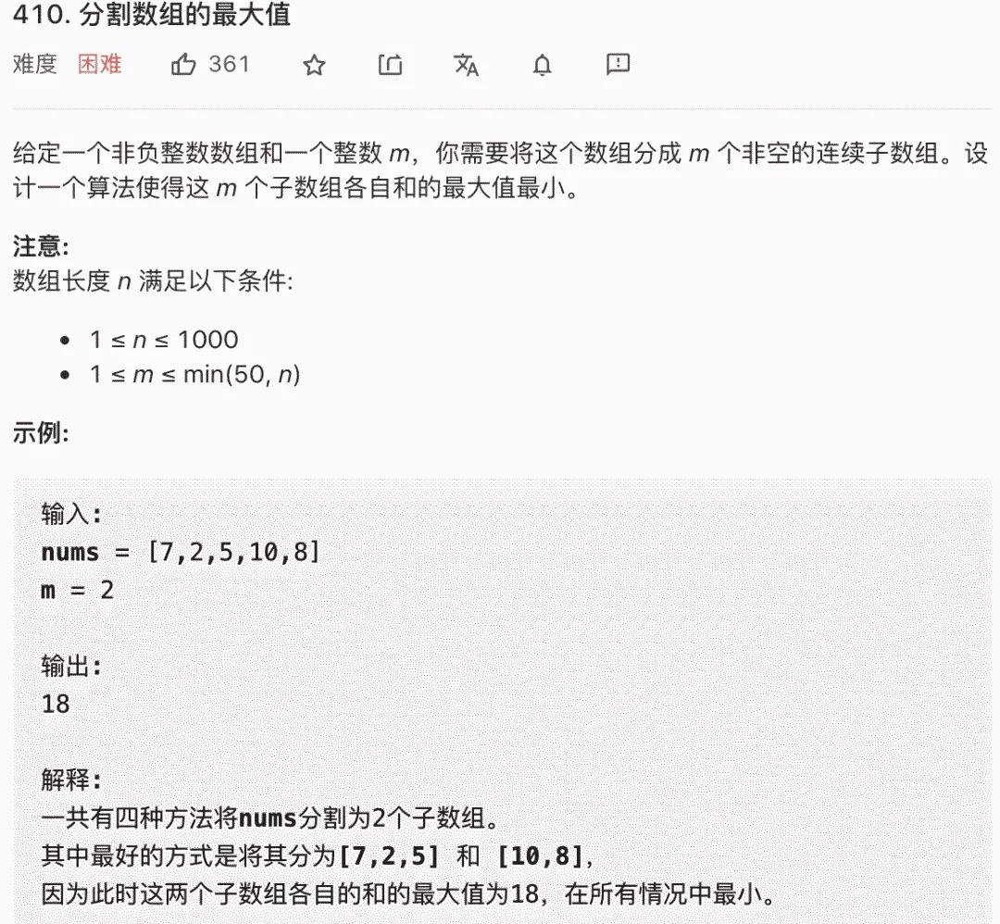

## 二分查找算法如何运用？我和快手面试官进行了深入探讨…

## 本文转载自微信公众号labuladong，《[二分查找算法如何运用？我和快手面试官进行了深入探讨…](https://mp.weixin.qq.com/s/0OaNLfQznaJAkjx870xRLQ)》，仅用于记录算法学习

经常有读者问我，读了之前的爆文 [二分查找框架详解](http://mp.weixin.qq.com/s?__biz=MzAxODQxMDM0Mw==&mid=2247485044&idx=1&sn=e6b95782141c17abe206bfe2323a4226&chksm=9bd7f87caca0716aa5add0ddddce0bfe06f1f878aafb35113644ebf0cf0bfe51659da1c1b733&scene=21#wechat_redirect) 之后，二分查找的算法他写的很溜了，但仅仅局限于在数组中搜索元素，不知道底怎么在算法题里面运用二分查找技巧来优化效率。

**那我先说结论，你想用二分查找技巧优化算法，首先要把 for 循环形式的暴力算法写出来，如果算法中存在如下形式的 for 循环**：

```
// func(i) 是 i 的单调函数（递增递减都可以）
int func(int i);

// 形如这种 for 循环可以用二分查找技巧优化效率
for (int i = 0; i < n; i++) {
    if (func(i) == target)
        return i;
}
```

**如果`func(i)`函数是在`i`上单调的函数，一定可以使用二分查找技巧优化 for 循环**。

「在`i`上单调的函数」是指`func(i)`的返回值随着`i`的增加而增加，或者随着`i`的增加而减小。

为什么满足这个条件就可以使用二分查找？**因为这个逻辑和「在有序数组中查找一个元素」是完全一样的呀**！

在**有序数组**`nums`中查找某一个数`target`，是不是最简单二分查找形式？我们看下普通的 for 循环遍历算法：

```
// nums 是一个有序数组
int[] nums;
// target 是要搜索的元素
int target;

// 搜索 target 在 nums 中的索引
for (int i = 0; i < nums.length; i++) {
    if (nums[i] == target)
        return i;
}
```

既然`nums`是有序数组，你把`nums[i]`看做函数调用，是不是可以理解为`nums`在参数`i`上是单调的？这是不是和之前说的`func(i)`函数完全一样？

当然，前文 [二分查找框架详解](http://mp.weixin.qq.com/s?__biz=MzAxODQxMDM0Mw==&mid=2247485044&idx=1&sn=e6b95782141c17abe206bfe2323a4226&chksm=9bd7f87caca0716aa5add0ddddce0bfe06f1f878aafb35113644ebf0cf0bfe51659da1c1b733&scene=21#wechat_redirect) 说过，二分查找算法还有搜索左侧、右侧边界的变体，怎么运用到具体算法问题中呢？

还是注意观察 for 循环形式，只是不一定是`func(i) == target`作为终止条件，可能是`<=`或者`>=`的关系，这个可以根据具体的题目意思来推断，我们实操一下力扣[第 410 题「分割数组的最大值」](https://leetcode-cn.com/problems/split-array-largest-sum/)，难度 **Hard**：



函数签名如下：

```
int splitArray(int[] nums, int m);
```

这个题目有点类似前文一道经典动态规划题目 [高楼扔鸡蛋](http://mp.weixin.qq.com/s?__biz=MzAxODQxMDM0Mw==&mid=2247484675&idx=1&sn=4a4ac1c0f1279530b42fedacc6cca6e6&chksm=9bd7fb0baca0721dda1eaa1d00b9a520672dc9d5c3be762eeca869be35d7ce232922ba8e928b&scene=21#wechat_redirect)，题目比较绕，又是最大值又是最小值的。

简单说，给你输入一个数组`nums`和数字`m`，你要把`nums`分割成`m`个子数组。

肯定有不止一种分割方法，每种分割方法都会把`nums`分成`m`个子数组，这`m`个子数组中肯定有一个和最大的子数组对吧。

我们想要找一个分割方法，该方法分割出的最大子数组和是所有方法中最大子数组和最小的。

请你的算法返回这个分割方法对应的最大子数组和。

我滴妈呀，这个题目看了就觉得 Hard，完全没思路，这题怎么能和二分查找算法扯上关系？

说个小插曲，快手面试有一道画师画画的算法题，很难，就是以这道题为原型。当时我没做过这道力扣题，面试有点懵，不过之前文章 [二分查找算法运用](http://mp.weixin.qq.com/s?__biz=MzAxODQxMDM0Mw==&mid=2247484598&idx=1&sn=69edaf4a7f6bfd0b1185cae5d0689c1d&chksm=9bd7fabeaca073a8820bc93cb67a8e26fa9eaa1ab9717b7e3ac41b4aac12235067c8af3520d5&scene=21#wechat_redirect) 写了两道类似的比较简单的题目，外加面试官的提示，把那道题做出来了。

**面试做算法题的时候，题目一般都会要求算法的时间复杂度，如果你发现 O(NlogN) 这样存在对数的复杂度，一般都要往二分查找的方向上靠，这也算是个小套路**。

言归正传，如何解决这道数组分割的问题？

首先，一个拍脑袋的思路就是用 [回溯算法框架](http://mp.weixin.qq.com/s?__biz=MzAxODQxMDM0Mw==&mid=2247484709&idx=1&sn=1c24a5c41a5a255000532e83f38f2ce4&chksm=9bd7fb2daca0723be888b30345e2c5e64649fc31a00b05c27a0843f349e2dd9363338d0dac61&scene=21#wechat_redirect) 暴力穷举呗，我简单说下思路：

你不是要我把`nums`分割成`m`个子数组，然后计算巴拉巴拉又是最大又是最小的那个最值吗？那我把所有分割方案都穷举出来，那个最值肯定可以算出来对吧？

怎么穷举呢？把`nums`分割成`m`个子数组，相当于在`len(nums)`个元素的序列中切`m - 1`刀，对于每两个元素之间的间隙，我们都有两种「选择」，切一刀，或者不切。

你看，这不就是标准的回溯暴力穷举思路嘛，我们根据穷举结果去计算每种方案的最大子数组和，肯定可以算出答案。

但是回溯的缺点就是复杂度很高，我们刚才说的思路其实就是「组合」嘛，时间复杂度就是组合公式：


时间复杂度其实是非常高的，所以回溯算法不是一个好的思路，还是得上二分查找技巧，反向思考这道题。

**现在题目是固定了`m`的值，让我们确定一个最大子数组和；所谓反向思考就是说，我们可以反过来，限制一个最大子数组和`max`，来反推最大子数组和为`max`时，至少可以将`nums`分割成几个子数组**。

比如说我们可以写这样一个`split`函数：

```
// 在每个子数组和不超过 max 的条件下，
// 计算 nums 至少可以分割成几个子数组
int split(int[] nums, int max);
```

比如说`nums = [7,2,5,10]`，若限制`max = 10`，则`split`函数返回 3，即`nums`数组最少能分割成三个子数组，分别是`[7,2],[5],[10]`。

如果我们找到一个最小`max`值，满足`split(nums, max)`和`m`相等，那么这个`max`值不就是符合题意的「最小的最大子数组和」吗？

现在就简单了，我们只要对`max`进行穷举就行，那么最大子数组和`max`的取值范围是什么呢？

显然，子数组至少包含一个元素，至多包含整个数组，所以「最大」子数组和的取值范围就是闭区间`[max(nums), sum(nums)]`，也就是最大元素值到整个数组和之间。

那么，我们就可以写出如下代码：

```java
/* 主函数，计算最大子数组和 */
int splitArray(int[] nums, int m) {
    int lo = getMax(nums), hi = getSum(nums);
    for (int max = lo; max <= hi; max++) {
        // 如果最大子数组和是 max，
        // 至少可以把 nums 分割成 n 个子数组
        int n = split(nums, max);
        // 为什么是 <= 不是 == ？
        if (n <= m) {
            return max;
        }
    }

    return -1;
}

/* 辅助函数，若限制最大子数组和为 max，
计算 nums 至少可以被分割成几个子数组 */
int split(int[] nums, int max) {
    // 至少可以分割的子数组数量
    int count = 1;
    // 记录每个子数组的元素和
    int sum = 0;
    for (int i = 0; i < nums.length; i++) {
        if (sum + nums[i] > max) {
            // 如果当前子数组和大于 max 限制
            // 则这个子数组不能再添加元素了
            count++;
            sum = nums[i];
        } else {
            // 当前子数组和还没达到 max 限制
            // 还可以添加元素
            sum += nums[i];
        }
    }
    return count;
}

// 计算数组中的最大值
int getMax(int[] nums) {
    int res = 0;
    for (int n : nums)
        res = Math.max(n, res);
    return res;
}

// 计算数组元素和
int getSum(int[] nums) {
    int res = 0;
    for (int n : nums)
        res += n;
    return res;
}
```

这段代码有两个关键问题：

**1、对`max`变量的穷举是从`lo`到`hi`即从小到大的**。

这是因为我们求的是「最大子数组和」的「最小值」，且`split`函数的返回值有单调性，所以从小到大遍历，第一个满足条件的值就是「最小值」。

**2、函数返回的条件是`n <= m`，而不是`n == m`**。按照之前的思路，应该`n == m`才对吧？

其实，`split`函数采用了贪心的策略，计算的是`max`限制下**至少**能够将`nums`分割成几个子数组。

举个例子，输入`nums = [2,1,1], m = 3`，显然分割方法只有一种，即每个元素都认为是一个子数组，最大子数组和为 2。

但是，我们的算法会在区间`[2,4]`穷举`max`，当`max = 2`时，`split`会算出`nums`**至少**可以被分割成`n = 2`个子数组`[2]`和`[1,1]`。

当`max = 3`时算出`n = 2`，当`max = 4`时算出`n = 1`，显然都是小于`m = 3`的。

所以我们不能用`n == m`而必须用`n <= m`来找到答案，**因为如果你能把`nums`分割成 2 个子数组（`[2],[1,1]`），那么肯定也可以分割成 3 个子数组（`[2],[1],[1]`）**。

好了，现在 for 循环的暴力算法已经写完了，但是无法通过力扣的判题系统，会超时。

由于`split`是单调函数，且符合二分查找技巧进行优化的标志，所以可以试图改造成二分查找。

那么应该使用搜索左侧边界的二分查找，还是搜索右侧边界的二分查找呢？这个还是要看我们的算法逻辑：

```java
int lo = getMax(nums), hi = getSum(nums);
for (int max = lo; max <= hi; max++) {
    int n = split(nums, max);
    if (n <= m) {
        return max;
    }
}
```

因为split函数为给定max的情况下，返回n的最小值，并且随着max的减小，n会增大，因此寻找左边界。

可能存在多个`max`使得`split(nums, max)`算出相同的`n`，**因为我们的算法会返回最小的那个`max`，所以应该使用搜索左侧边界的二分查找算法**。

现在，问题变为：在闭区间`[lo, hi]`中搜索一个最小的`max`，使得`split(nums, max)`恰好等于`m`。

那么，我们就可以直接套用搜索左侧边界的二分搜索框架改写代码：

```java
int splitArray(int[] nums, int m) {
    // 一般搜索区间是左开右闭的，所以 hi 要额外加一
    int lo = getMax(nums), hi = getSum(nums) + 1;
    while (lo < hi) {
        int mid = lo + (hi - lo) / 2;
        // 根据分割子数组的个数收缩搜索区间
        int n = split(nums, mid);
        if (n == m) {
            // 收缩右边界，达到搜索左边界的目的
            hi = mid;
        } else if (n < m) {
            // 最大子数组和上限高了，减小一些
            hi = mid;
        } else if (n > m) {
            // 最大子数组和上限低了，增加一些
            lo = mid + 1;
        }
    }
    return lo;
}

int split(int[] nums, int max) {/* 见上文 */}
int getMax(int[] nums) {/* 见上文 */}
int getSum(int[] nums) {/* 见上文 */}
```

go代码实现

```go
func splitArray(nums []int, m int) int {
    if len(nums) == 0{
        return 0
    }

    left := getMax(nums)
    right := getSum(nums)

    for left <= right{
        mid := left + (right - left) / 2
        tmp := split(nums, mid)
        if tmp < m{
            right = mid - 1
        }else if  tmp > m{
            left = mid + 1
        }else if tmp == m{
            right = mid - 1
        }
    }
    //本题不存在找不到target，导致数组越界的情况
    return left
}

func split(nums []int, max int) int{
    var sum int = 0
    var count int = 1
    for _, x := range nums{
        if sum + x > max{
            count++
            sum = x
        }else{
            sum = sum + x
        }
    }
    return count
}

func getMax(nums []int) int {
    var max int = 0
    for _, x := range nums{
        if max < x{
            max = x
        }
    }
    return max
}

func getSum(nums []int) int{
    var sum int = 0
    for _, x := range nums{
        sum = sum + x
    }
    return sum
}
```

这段二分搜索的代码就是标准的搜索左侧边界的代码框架，如果不理解可以参见前文 [二分查找框架详解](http://mp.weixin.qq.com/s?__biz=MzAxODQxMDM0Mw==&mid=2247485044&idx=1&sn=e6b95782141c17abe206bfe2323a4226&chksm=9bd7f87caca0716aa5add0ddddce0bfe06f1f878aafb35113644ebf0cf0bfe51659da1c1b733&scene=21#wechat_redirect)，这里就不展开了。

至此，这道题就通过二分查找技巧高效解决了。假设`nums`元素个数为`N`，元素和为`S`，则`split`函数的复杂度为`O(N)`，二分查找的复杂度为`O(logS)`，所以算法的总时间复杂度为`O(N*logS)`。